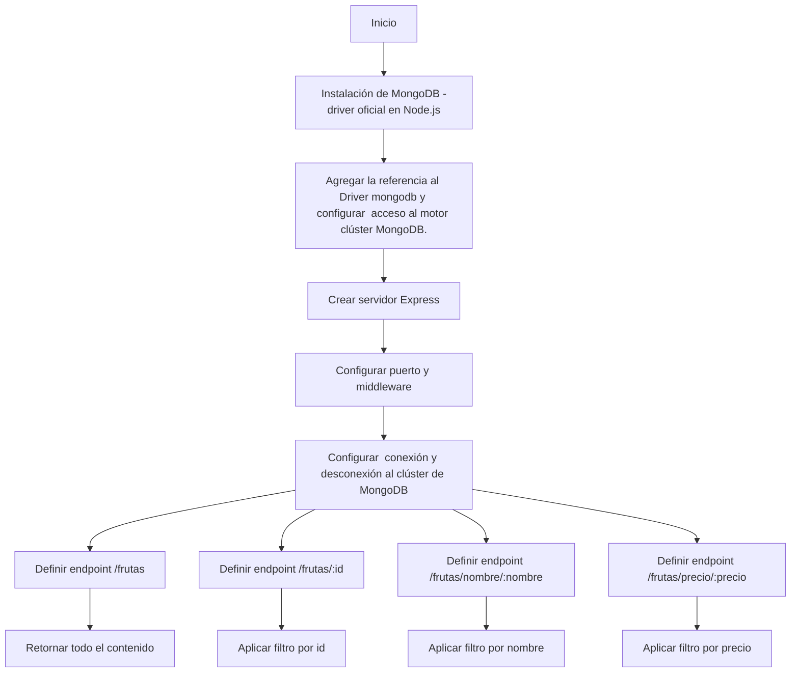
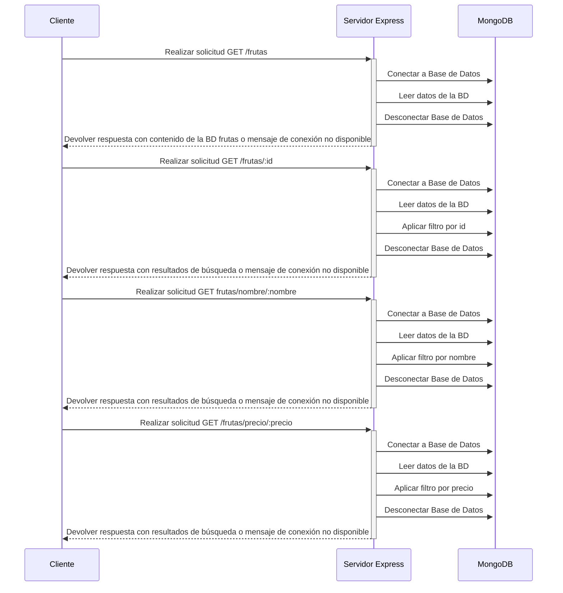

# App FRUTAS
La funcionalidad principal de esta app es contar con una Base de Datos llamada Mongodb, donde se podrán consultar nombre, precios y tipos de frutas disponibles

## Requisitos funcionales:
Instalar:
#### Node Js: https://nodejs.org/es
#### Base de datos MongoDB Compass: https://www.mongodb.com/products/tools/compass

## Dependencias a instalar:
En terminal de Visual Code, ejecutar comando:
```
npm i 
```
```
npm i dotenv express mongodb nodemon
```
## Ejecución del proyecto:
En terminal de Visual Code, ejecutar comando:
```
 node server.js
```
## Extension de Visual Code a instalar:
Thunder Client es una extensión liviana y sencilla que sirve para simular llamadas a las API


## Consulta a Base de Datos
#### Paso 1

#### Paso 2

#### Paso 3


## Resumen consulta a Base de Datos
| PETICION |  URL | DESCRIPCION |
|:--------:|-----|-------------|
|GET |[/frutas](/frutas)| Obtener todas las frutas| 
|GET |[/frutas/:id](/frutas)| Obtener todas las frutas por id| 
|GET |[/frutas/nombre/:nombre](/frutas)| Obtener frutas por nombre| 
|GET |[/frutas/precio/:precio](/frutas)| Obtener frutas por precio| 

## Diagrama de Flujo
```
Un codigo de mermaid js de un diagrama de flujo de una app que permite consultar en una base de datos (MongoDB), nombre, precios y tipos de frutas.
```
### Mermaid


## Diagrama de Secuencia
### Mermaid


```
Este diagrama de secuencia representa las interacciones entre el cliente y el servidor Express para
cada uno de los endpoints mencionados en el flujo original. Cada solicitud del cliente al servidor
se procesa en el servidor Express y se devuelve una respuesta correspondiente al resultado de la consulta.
```